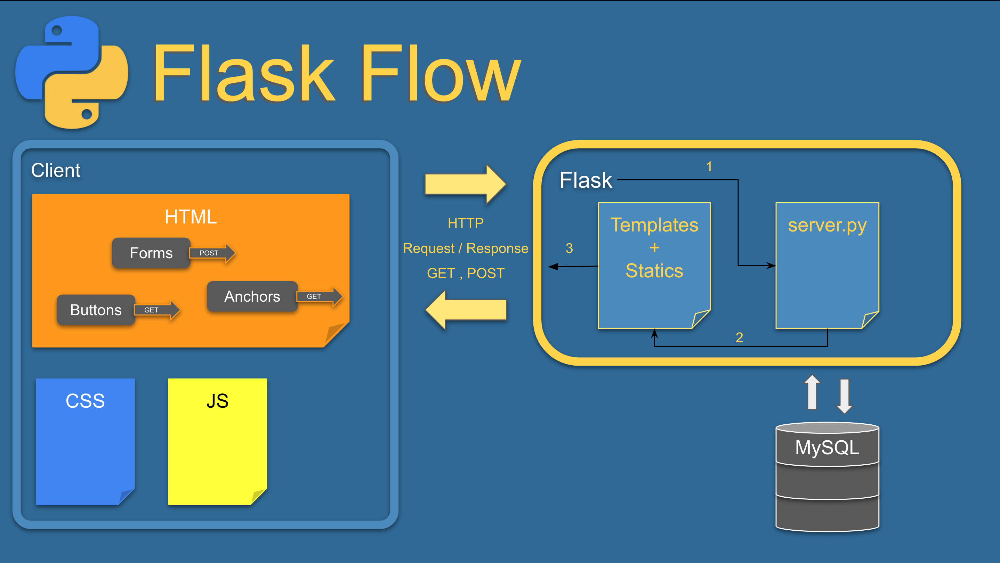

# Set-Up for a Flask Project

### Resources

- [Tailwind CSS Cheat Sheet](https://nerdcave.com/tailwind-cheat-sheet)

---

## Flask Flow



### Flow:

1. The HTTP request is made and hits the server.py file.
2. Based on the route we give, it gathers up any HTML, CSS, JS, and data.
3. Then it responds back to the browser with what we return.

## Virtual Environments

> When we are working as a developer, we might find ourselves working on different projects or teams in our work place. These projects might use the same programming language, but different versions and packages along the way. How do we keep ourselves organized and avoid conflicts with our OS? With Python the answer is Virtual Environments.

### Installing our Virtual Environment tool

> While there are a couple different ways to create virtual environments, we are going to be using `pipenv` to streamline the process. To get started we need to use pip to install pipenv globally.  
> **Note** : _Only need to do once per device_

- [ ] Windows: <br><br>

      pip install pipenv

- [ ] Mac: <br><br>

      pip3 install pipenv

### Installing Flask 


- [ ] Now that we have pipenv installed, let's create a new project folder and `cd` into it.

- [ ] Once we are in the project folder we can use pipenv to install Flask and any other necessary packages.  
**Note** : _The first time we run `pipenv install`, it will create 2 files for us, `Pipfile` and `Pipfile.lock`. Both are needed in order to use the installed packages, but difference between the two include: `Pipfile` will display the packages installed, and `Pipfile.lock` will have the specific details on what version is being used._
  - PyMySQL allows us to connect Flask to a MySQL database
  - flask-bcrypt allows us to hash passwords
  <br><br>
  ```
  pipenv install flask PyMySQL flask-bcrypt
  ```

### Activating our Virtual Environment

- [ ] Once we have installed the Flask package, we need to activate our environment in order to use it. We can achieve this with the following command.

      pipenv shell

### Checking What's Installed with `pip list`

- [ ] To check what is installed in your virtual environment, with your virtual environment activated (`pipenv shell`), you can type the command, `pip list` and you will see a list of what is currently installed. For instance if you wanted to verify for a particular project that you have Flask installed you would activate your environment then use this command as shown below.

      pip list

### Start your build process

- [ ] Run either of these commands to start your project:<br><br>
      npm start             // refreshes tab upon saving
      npx nodemon           // creates new tab upon saving
